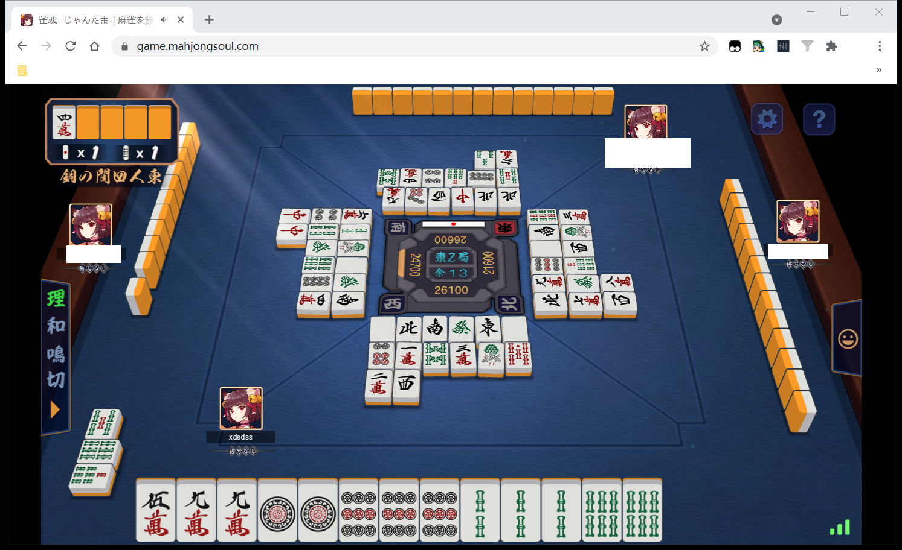
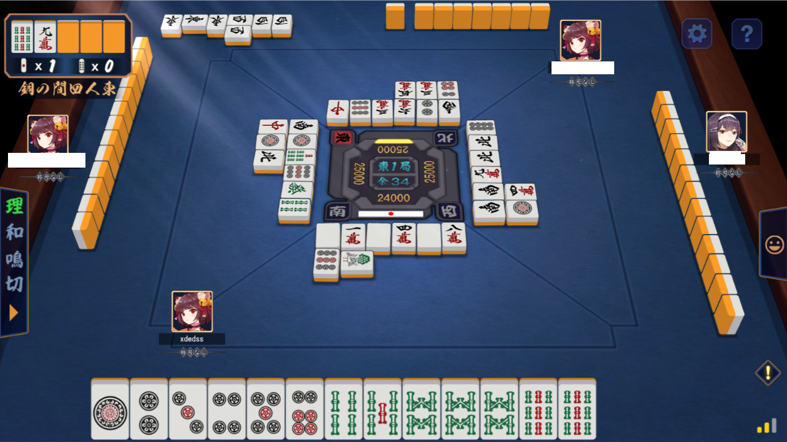
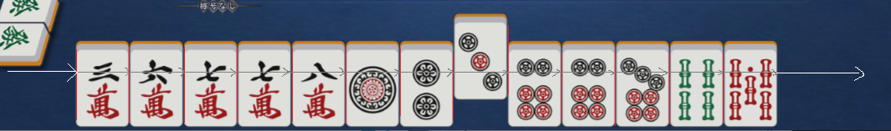
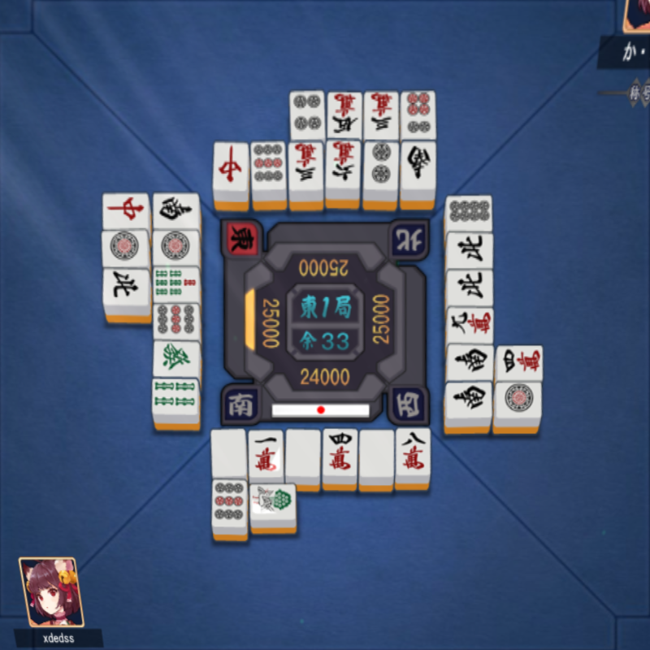
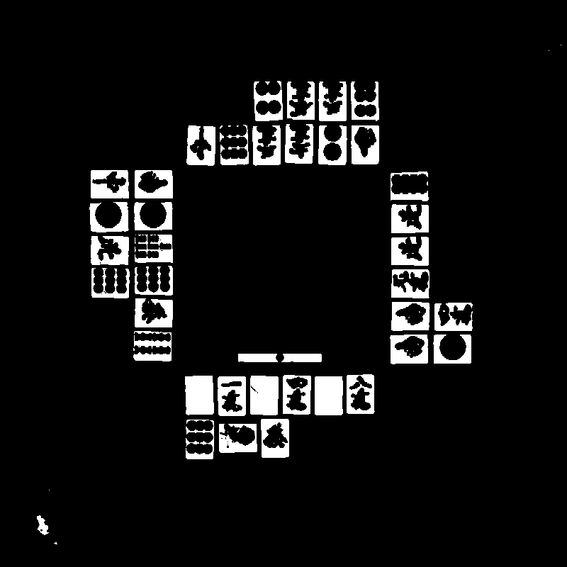
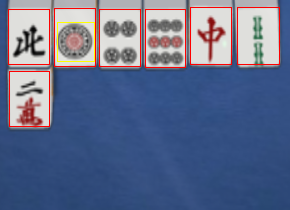
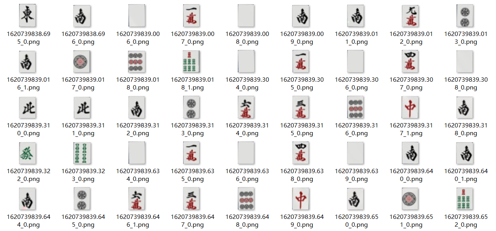
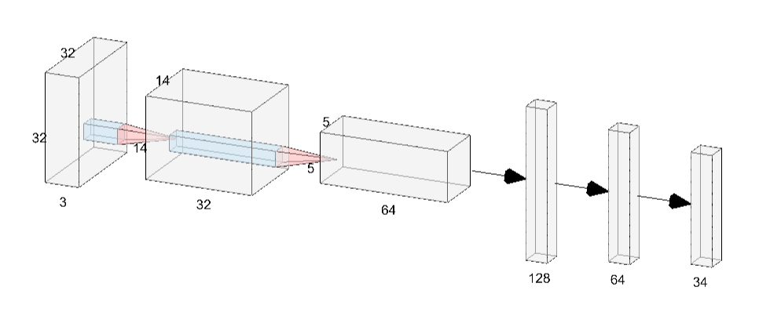

# 运行

python依赖：[requirements.txt](requirements.txt)

运行前先打开游戏进入主界面以便配准的进行（必须使用默认背景和样式）

运行断幺九AI：
``` shell
python ./cvmaj.py no19
```

其中no19可以换成ai文件夹内的其他文件名（不含后缀）


# 实现

## (一)游戏画面获取

[scrutils.py](scrutils.py)

#### 窗口截图

- 根据窗口名包含“雀魂”来找到浏览器窗口

- 调用windows的PrintWindow获取窗口内容截图，这样即使被其他窗口遮挡也能获取到画面

截取到的画面长这样：



#### 画面配准

截取的画面还有浏览器的边框，因此需要先定位游戏画面，剔除边框并缩放到一个固定的大小以便后续处理。

用事先准备的游戏画面模板（位于templates\multiple），提取SIFT特征点，与截取画面中特征点进行匹配。

假设画面只存在平移和缩放，有三个未知数$S, T_x, T_y$，对于每一对匹配点$(x_i,y_i)$->$(u_i,v_i)$有如下关系

$$
\left\{\begin{matrix}
Sx_i + T_x = u_i \\
Sy_i + T_y = v_i
\end{matrix}\right.
$$

对于n对匹配点，写成矩阵形式：

$$
\begin{bmatrix}
 x_1 & 1 & 0\\
 y_1 & 0 & 1\\
 \vdots & \vdots & \vdots\\
 x_n & 1 & 0\\
 y_n & 0 & 1
\end{bmatrix}
\begin{bmatrix}
S \\
T_x \\
T_y
\end{bmatrix}
=
\begin{bmatrix}
u_1 \\
v_1 \\
\vdots \\
u_n \\
v_n
\end{bmatrix}
$$

记为$A\mathbb{m}=\mathbb{b}$其中


$$
A=\begin{bmatrix}
 x_1 & 1 & 0\\
 y_1 & 0 & 1\\
 \vdots & \vdots & \vdots\\
 x_n & 1 & 0\\
 y_n & 0 & 1
\end{bmatrix}
,\mathbb{m}=
\begin{bmatrix}
S \\
T_x \\
T_y
\end{bmatrix}
,\mathbb{b}=
\begin{bmatrix}
u_1 \\
v_1 \\
\vdots \\
u_n \\
v_n
\end{bmatrix}
$$

$A$和$b$均为已知，要求$\mathbb{m}$，用最小二乘法，得到

$$
\mathbb{m}=(A^TA)^{-1}A^T\mathbb{b}
$$

这样就求出了变换矩阵

然而总是会有一些匹配点是歪的，所以接下来把所有屏幕特征点按求出的矩阵重投影到模板坐标中，和实测得到的模板特征点比较，删除误差较大的点，然后重复上述过程，直到平均重投影误差收敛到1像素以内，就能得到比较准确的结果。

画面配准只用做一次，以后只要窗口大小不变，变换矩阵也不会变。之后的截图全部用变换矩阵变化到标准的1280x720大小，这上面UI的位置都是固定的，很容易进行接下来的识别工作。



## （二）牌面图案提取

[segutils.py](segutils.py)

手牌很好提取，都是固定的位置，从左到右遍历像素，遇到有牌就截下来即可



桌子由于有透视形变，首先利用桌上正方形纹路的四个顶点做一个透视校正



牌面的底色是固定的，做一个阈值分割



按照每家的牌切成4块，分别做识别。

识别时先检测闭合边界，对每个闭合边界求包络矩形，面积过小的舍去，剩下的为候选框。



由于牌的大致位置是固定的只是有微小的旋转和平移变化，所以用一个滑动窗口在预计有牌的位置匹配候选框。由于可能有立直打出的牌是横着放的，所以分别假设下一张是横或竖，根据与候选框的交并比判断哪个更有可能。

提取结果



## （三）牌面图案识别

#### 数据集标注

（一）和（二）提取出了大量的图案样本放到了samples/tiles里面，接下来手动标注，把每个图片放到samples/tiles/labeled/label中的对应文件夹里

这一过程可以借助[samples/tiles/label.py](samples/tiles/label.py)比较方便地完成，只要看图然后在命令行里输入正确的结果即可

（github上传的是标注完成的数据的压缩包pack.zip，如果想用来自己训练的话需要手动解压）

#### 数据处理和增强

[dataset.py](dataset.py)

所有图片拉伸到32x32大小

考虑到有时牌面提取可能会歪一点，以及有时会出现宝牌的闪光，所以在读取数据集时给它随机加一个平移，并随机画一条白线，保证遇到上述两种情况时模型还能可靠工作

#### 模型结构

[models.py](models.py)

3个5x5卷积+池化，得到128维特征，再经过2个全连接层，输出34维的分类结果



（结构图用[NN-SVG](https://alexlenail.me/NN-SVG/AlexNet.html)绘制）

#### 模型训练

[visionutils.py](visionutils.py)

标准的训练过程，模型比较简单，即使是用cpu也很快。

训练的checkpoint会存到save_temp文件夹。

[pretrained.tar](pretrained.tar)是已经训练好的模型，验证集正确率在98%以上

## （四）杂项

#### 鸣牌/立直/和牌选项检测

这些东西由于都在屏幕上的固定位置，只是颜色不同，所以按每个按钮的颜色做阈值分割，统计命中像素数，如果足够多就判定出现了选项按钮

#### 副露

副露提取待完成

## （五）AI接口

AI模块放在[ai文件夹里](ai/)

编写一个AI需要实现discard和action两个函数，发生相应事件的时候会被调用做出决策


